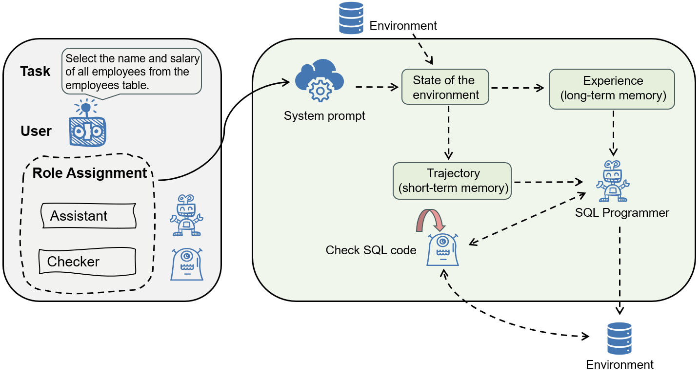
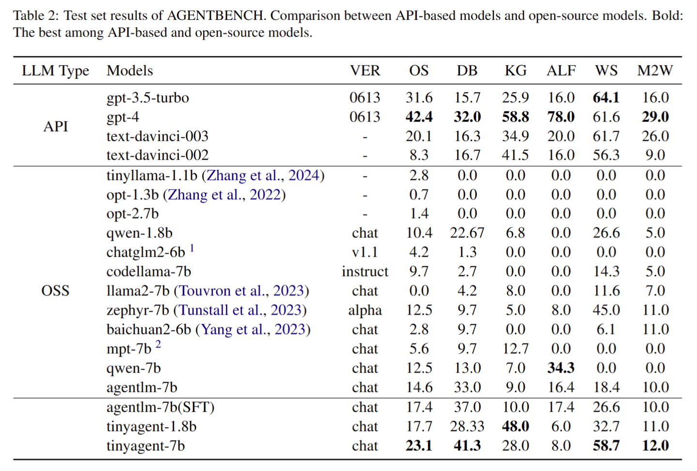
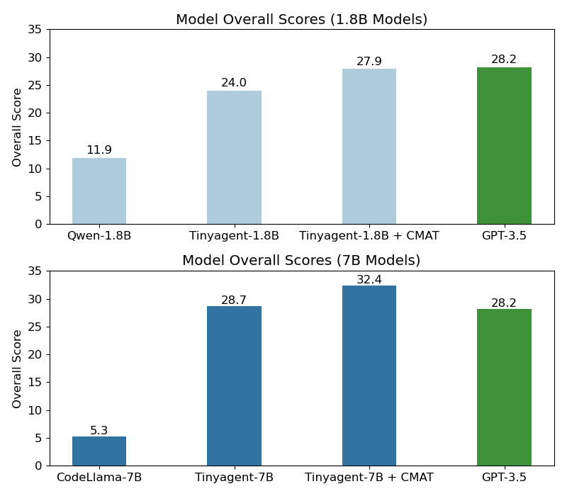
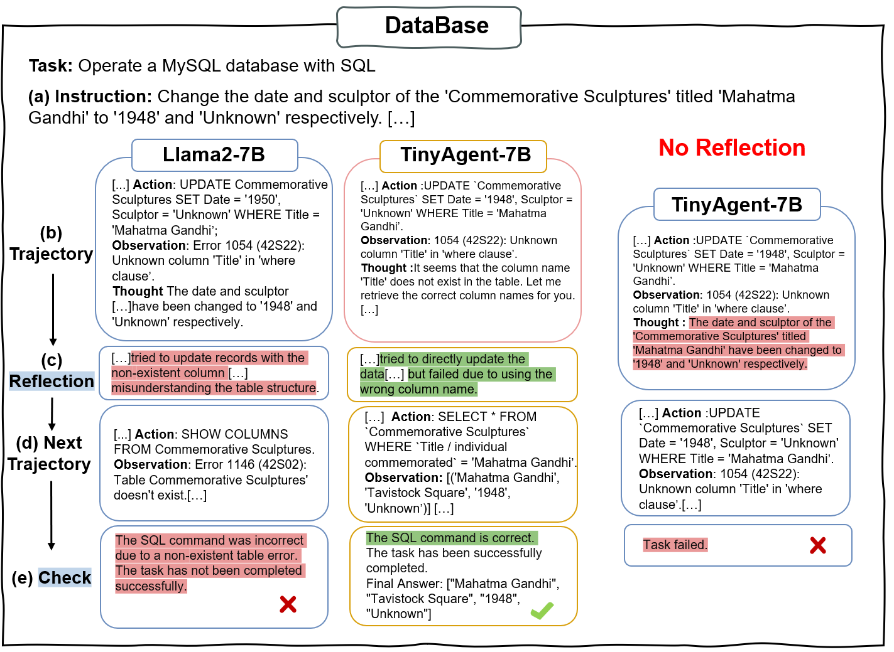

# CMAT: A Multi-Agent Collaboration Tuning Framework for Enhancing Small Language Models

## 📌Introducing CMAT 🎉

Welcome to CMAT! The main contributions of our work are as follows:
- We propose the CMAT framework which represents an innovative approach that allows for dynamic and real-time memory updates within multi-agent systems.
- We design a novel role-playing mechanism for precise task allocation and enhanced agent communication, significantly boosting overall performance and cooperation.
- We evaluated the fine-tuned TinyAgent models across multiple agent tasks, finding that in certain scenarios, their performance rivals that of advanced LLMs like GPT-4 and agentlm ~\cite{zeng2023agenttuning}, demonstrating the potential efficiency and capabilities of compact models.


In the CMAT framework, the user assigns tasks to an assistant, which generates SQL commands based on short-term and long-term memories: short-term memory provides immediate context from trajectory history, while self-reflective outputs are stored as long-term memory. The checker verifies the correctness of SQL commands before they are executed in the environment.

If you're looking for an older version of a similar project, you can find it here.
Building upon a solid foundation, we've made several enhancements in Memory-agentBench:
- **Revamped Framework Architecture**: We've redesigned the architecture to be more user-friendly and extendable, ensuring that users can easily integrate and experiment with memory capabilities in their models.
- **Task Settings Adjustments**: Some task configurations have been fine-tuned to better challenge and demonstrate the enhanced capabilities of models equipped with memory functions.
- **Expanded Model Testing**: Additional test results for a wider range of models are now available, showcasing the impact of memory integration on model performance.
- **Comprehensive Data Release**: Both Development and Test datasets have been fully released, providing ample material for rigorous testing and benchmarking.
Moreover, the introduction of a memory mechanism aims to significantly boost the agent's performance across diverse tasks. This upgrade allows agents to remember and leverage past interactions, enabling more effective handling of sequential and complex challenges.

# CMAT: Evaluating LLMs as Agents

The testing environment of CMAT encompasses 8 distinct environments to provide a more comprehensive evaluation of the LLMs' ability to operate as autonomous agents in various scenarios. 
These environments include 5 freshly created domains, namely

-   Operating System (OS)
-   Database (DB)
-   Knowledge Graph (KG)
-   Digital Card Game (DCG)
-   Lateral Thinking Puzzles (LTP)

as well as 3 recompiled from published datasets:

-   House-Holding (HH) ([ALFWorld](https://github.com/alfworld/alfworld))
-   Web Shopping (WS) ([WebShop](https://github.com/princeton-nlp/webshop))
-   Web Browsing (WB) ([Mind2Web](https://github.com/OSU-NLP-Group/Mind2Web))


## Table of Contents

-   [Dataset Summary](#dataset-summary)
-   [Leaderboard](#leaderboard)
-   [Quick Start](#quick-start)
-   [Next Steps](#next-steps)
-   [Citation](#citation)

## Dataset Summary

We provide two dataset splits: Development (Dev) and Test, each designed to facilitate comprehensive evaluations with trajectory data. The multi-turn interaction design challenges LLMs to generate responses across approximately 4,000 instances for the Dev split and 13,000 instances for the Test split. This setup, enriched with trajectory data, is meticulously crafted to assess the LLMs' ability to navigate through tasks by leveraging past interactions and decisions, thereby offering a more nuanced insight into their capability to understand, predict, and act in dynamic scenarios.


## Leaderboard

Here is the scores on test set (standard) results of CMAT.




TinyAgent demonstrates outstanding performance, comparable to that of GPT-3.5. 


Comparative study of Llama-2-7b and TinyAgent-7b in DataBase cases. (1) In DataBase tasks with a reflection mechanism, Llama-2-7b still made errors after reflection, while TinyAgent-7b adjusted its operations after reflecting on its first failed attempt. (2) Without a reflection mechanism, TinyAgent-7b repeated the same operation and ultimately failed to complete the task.

## Quick Start

This section will guide you on how to quickly use gpt-3.5-turbo-0613 as an agent to launch the `dbbench-std` and `os-std` tasks.
For the specific framework structure, please refer to [Framework Introduction](docs/Introduction_en.md).
For more detailed configuration and launch methods, please check [Configuration Guide](docs/Config_en.md)
and [Program Entrance Guide](docs/Entrance_en.md).

### Step 1. Prerequisites

Clone this repo and install the dependencies.

```bash
cd Memory-agentBench
conda create -n agent-bench python=3.9
conda activate agent-bench
pip install -r requirements.txt
```

Ensure that [Docker](https://www.docker.com/) is properly installed.

```bash
docker ps
```

Build required images for `dbbench-std` and `os-std`.

```bash
docker pull mysql
docker pull ubuntu
docker build -f data/os_interaction/res/dockerfiles/default data/os_interaction/res/dockerfiles --tag local-os/default
docker build -f data/os_interaction/res/dockerfiles/packages data/os_interaction/res/dockerfiles --tag local-os/packages
docker build -f data/os_interaction/res/dockerfiles/ubuntu data/os_interaction/res/dockerfiles --tag local-os/ubuntu
```

### Step 2. Configure the Agent

Fill in your OpenAI API Key at the correct location in `configs/agents/openai-chat.yaml`. (e.g. `gpt-3.5-turbo-0613`)

You can try using `python -m src.client.agent_test` to check if your agent is configured correctly.

By default, `gpt-3.5-turbo-0613` will be started. You can replace it with other agents by modifying the parameters:

```bash
python -m src.client.agent_test --config configs/agents/api_agents.yaml --agent gpt-3.5-turbo-0613
```

### Step 3. Start the task server

Starting the task worker involves specific tasks. Manual starting might be cumbersome; hence, we provide an automated
script.

The assumption for this step is that ports from 5000 to 5015 are available. For Mac OS system, you may want to follow [here](https://stackoverflow.com/questions/69955686/why-cant-i-run-the-project-on-port-5000) to free port 5000 to use.

```bash
python -m src.start_task -a
```

This will launch five task_workers each for `dbbench-std` and `os-std` tasks and automatically connect them
to the controller on port 5000. **After executing this command, please allow approximately 1 minute for the task setup to complete.** If the terminal shows ".... 200 OK", you can open another terminal and follow step 4.

### Step 4. Start the assigner

This step is to actually start the tasks.

If everything is correctly configured so far, you can now initiate the task tests.

```bash
python -m src.assigner
```

## Next Steps

If you wish to launch more tasks or use other models, you can refer to the content
in [Configuration Guide](docs/Config_en.md) and [Program Entrance Guide](docs/Entrance_en.md).

For the environment of the remaining five tasks, you will need to download the Docker images we provide.

```
longinyu/agentbench-ltp
longinyu/agentbench-webshop
longinyu/agentbench-mind2web
longinyu/agentbench-card_game
longinyu/agentbench-alfworld
```

The resource consumption of a single task_worker for the eight tasks is roughly as follows; consider this when
launching:

| Task Name | Start-up Speed | Memory Consumption |
| --------- | -------------- | ------------------ |
| webshop   | ~3min          | ~15G               |
| mind2web  | ~5min          | ~1G                |
| db        | ~20s           | < 500M             |
| alfworld  | ~10s           | < 500M             |
| card_game | ~5s            | < 500M             |
| ltp       | ~5s            | < 500M             |
| os        | ~5s            | < 500M             |
| kd        | ~5s            | < 500M             |


